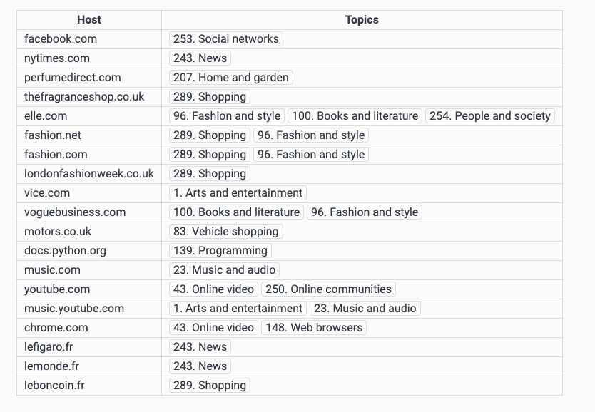

# Using Privacy Sandbox's Browsing Topics model to infer topics associated with hostnames

Command line tool to infer the topics associated with hostnames, using Google Chrome's model.


## Setting up the environment
First, make sure you are using Python 3.8 or above. Then, install the required packages:
```
$ pip install -r requirements.txt
```

## Usage
To infer topics for hostnames in `hostnames.txt`, just run the following script:
```
$ python topic_inference.py hostnames.txt
```
This should return a table similar to:
```
Hostname                                           Topics                                             Weight
--------------------------------------------------------------------------------------------------------------
facebook.com                                       253 - Social Networks                              1.00

nytimes.com                                        243 - News                                         1.00

perfumedirect.com                                  207 - Home & Garden                                0.80

thefragranceshop.co.uk                             289 - Shopping                                     0.11

elle.com                                           96 - Fashion & Style                               1.00
                                                   100 - Books & Literature                           1.00
                                                   254 - People & Society                             1.00

fashion.net                                        96 - Fashion & Style                               0.86
                                                   289 - Shopping                                     0.44

fashion.com                                        96 - Fashion & Style                               0.88
                                                   289 - Shopping                                     0.45

londonfashionweek.co.uk                            289 - Shopping                                     0.35

vice.com                                           1 - Arts & Entertainment                           0.31

voguebusiness.com                                  96 - Fashion & Style                               0.37
                                                   100 - Books & Literature                           0.36

motors.co.uk                                       83 - Vehicle Shopping                              0.50

docs.python.org                                    139 - Programming                                  0.85

music.com                                          23 - Music & Audio                                 0.65

youtube.com                                        43 - Online Video                                  1.00
                                                   250 - Online Communities                           1.00

music.youtube.com                                  1 - Arts & Entertainment                           1.00
                                                   23 - Music & Audio                                 1.00

chrome.com                                         148 - Web Browsers                                 0.88
                                                   43 - Online Video                                  0.47

lefigaro.fr                                        243 - News                                         1.00

lemonde.fr                                         243 - News                                         1.00

leboncoin.fr                                       289 - Shopping                                     1.00
```

Which coincide with [Chrome Canary classification](chrome://topics-internals/):





The provided weights are the weights returned by the Bert model used by the Topic feature under the hood.


Also, note that Chrome is using the file `override_list.pb` to override the model's results for some domains. This list contains almost 10k hostnames with associated topics that will take precedence over the model decision. Its structure is described by the [`page_topics_override_list.proto`](https://github.com/chromium/chromium/blob/main/components/optimization_guide/proto/page_topics_override_list.proto) file.

On the above results, topics with weights of `1.0` are overriden topics from the list.

## Limitations

### Weights discrepancies
The `topic_inference_test.py` script replicates [Chromium's unit tests](https://github.com/chromium/chromium/blob/main/chrome/browser/optimization_guide/page_content_annotations_service_browsertest.cc#L258) to check if our inference is equivalent to what the Chrome is doing. You can run them through:
```
$ python topic_inference_test.py
```
You should observe that one test fails, due to discrepancies between predicted and expected weights. While these differences are still relatively small, they could indicate we may have missed some details for the inference process:

```
# Weights returned by our implementation
[(250, '/Online Communities', 0.44546878),
 (1, '/Arts & Entertainment', 0.5195936), 
 (43, '/Arts & Entertainment/Online Video', 0.587349), 
 (23, '/Arts & Entertainment/Music & Audio', 0.8238641)]

# Expected weights, according to Chromium's unit tests
[(250, '/Online Communities', 0.450154),
 (1, '/Arts & Entertainment', 0.518014),
 (43, '/Arts & Entertainment/Online Video', 0.596481),
 (23, '/Arts & Entertainment/Music & Audio', 0.827426)]

```

### Model metadata
Chrome is using some post-processing algorithm to select the topics to return, according to the weights returned by the model. This algorithm rely on several parameters:
- `max_categories`: maximum number of topics to return for one hostname,
- `min_category_weight`: threshold to discard topics with a weight below its value,
- `min_normalized_weight_within_top_n`: threshold to discard topics with a normalized weight below its value, among pre-selected topic candidates. Normalization factor is the sum of pre-selected topics' weights.
- `min_none_weight`: threshold on the contribution of the None topic among all the pre-selected weights, above which no topic is returned.


These parameters are described by a protobuf structure called [PageTopicModelMetadata](https://github.com/chromium/chromium/blob/main/components/optimization_guide/proto/page_topics_model_metadata.proto) whose production version has yet to be found. Hence, the values used in `topic_inference.py` are "good guesses" made from the values found in the unit test, that appear to lead to the same results as Chrome Canary.


## Contact
Please reach out to romain.quere@xandr.com for any question or suggestion.

## References
- [Topic API documentation](https://developer.chrome.com/docs/privacy-sandbox/topics/)
- [Topics explainer](https://github.com/patcg-individual-drafts/topics)
- [Chromium source code](https://github.com/chromium/chromium)
